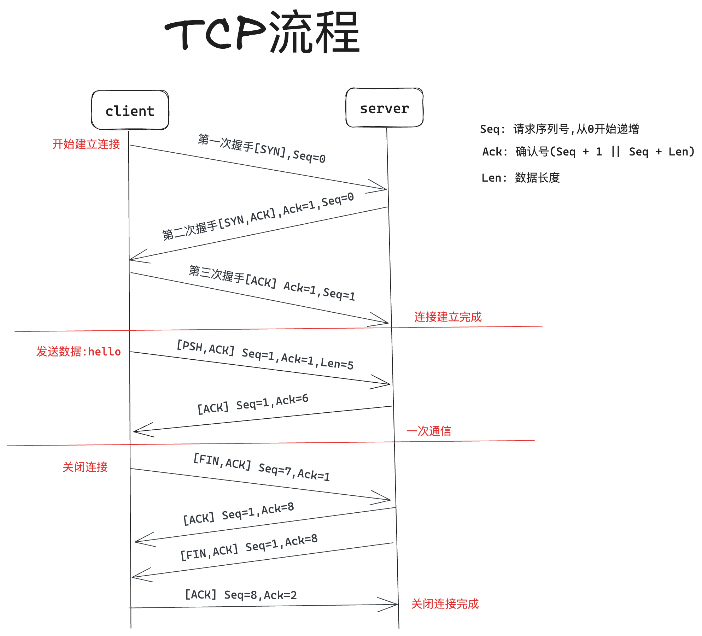

# Quic概要

QUIC是一个通用的传输层网络协议，最初由Google的Jim Roskind设计，2012年实现并部署，2013年随着实验范围的扩大而公开发布，并向IETF描述。虽然长期处于互联网草案阶段，但在从Chrome浏览器到Google服务器的所有连接中，超过一半的连接都使用了QUIC。Microsoft Edge、Firefox和Safari都支持它，但默认情况下没有启用。其于RFC9000中正式推出标准化版本。

虽然它的名字最初是作为 “快速UDP互联网连接”的首字母缩写提出的，但IETF使用的QUIC一词并不是首字母缩写，它只是协议的名称。QUIC提高了目前使用TCP的面向连接的网络应用的性能。它通过使用用户数据报协议（UDP）在两个端点之间建立若干个多路连接来实现这一目标，其目的是为了在网络层淘汰TCP，以满足许多应用的需求，因此该协议偶尔也会获得 “TCP/2”的昵称。

QUIC与HTTP/2的多路复用连接协同工作，允许多个数据流独立到达所有端点，因此不受涉及其他数据流的丢包影响。相反，HTTP/2建立在传输控制协议（TCP）上，如果任何一个TCP数据包延迟或丢失，所有多路数据流都会遭受队头阻塞延迟。

QUIC的次要目标包括降低连接和传输时延，以及每个方向的带宽估计以避免拥塞。它还将拥塞控制算法移到了两个端点的使用者空間，而不是内核空间，据称这将使这些算法得到更快的改进。此外，该协议还可以扩展前向纠错（FEC），以进一步提高预期错误时的性能，这被视为协议演进的下一步。

2015年6月，QUIC规范的互联网草案提交给IETF进行标准化。2016年，成立了QUIC工作组。2018年10月，IETF的HTTP工作组和QUIC工作组共同决定将QUIC上的HTTP映射称为 "HTTP/3"，以提前使其成为全球标准。2021年5月IETF公布RFC9000，QUIC规范推出了标准化版本。
简单来说：Quic就是使用UDP实现了 TCP + TLS + HTTP2的功能。

Quic按理来说应该归属于传输层，但是它是基于UDP之上，并且是在应用层实现，所以严格来说Quic是一个在应用层上实现的传输层协议。

参考[这里](https://hokofly.github.io/QUIC%E4%BC%A0%E8%BE%93%E6%A0%BC%E5%BC%8F%E8%A7%84%E8%8C%83(%E4%B8%AD%E6%96%87).html)

## TCP通信流程图

## 核心术语
- Client: 客户端点
- Server: 服务端点
- Connection: 连接，客户端与服务端之间的会话
- Stream: 连接中的通道流，数据通过通道流来双向传输，一个连接可以有多条流，多条流之间互不干扰

## Quic的基本特性
### 多路复用流
相互独立的逻辑流是 QUIC 的核心特性之一。它允许在单个连接上并行传输多个数据流，并且每个流可以独立地处理。相比之下，TCP 只支持单数据流，需要按照发送顺序接收和确认每个报文。通过多路复用，应用程序可以更高效地发送和接收数据，并更好地利用网络带宽等资源。

### 更好的安全性
QUIC 的另一个重要特性是它提供了端到端的安全保护。所有通过 QUIC 发送的数据都是默认加密的，并且不支持明文通信。这有助于防止数据被窃听和其他形式的攻击。QUIC 使用传输层安全协议（TLS）来建立和维护安全连接和端到端加密。

### 低延迟
QUIC将加密和传输握手结合在一起，减少了建立一条安全连接所需的往返。QUIC 连接通常是 0-RTT，意味着相比于 TCP + TLS 中发送应用数据前需要 1-3 个往返的情况，在大多数 QUIC 连接中，数据可以被立即发送而无需等待服务器的响应。

### 可靠性
QUIC 基于 UDP 但可提供可靠传输能力。类似于 TCP，它是一种面向连接的传输协议。QUIC 协议在数据传输过程中具有报文丢失恢复和重传功能，这可以确保数据的完整性和准确性。此外，QUIC 可以保证数据包按照发送顺序到达，避免因数据包乱序导致的数据错误。

### 连接迁移
TCP 连接由源地址，源端口，目标地址和目标端口的4元组标识。TCP 一个广为人知的问题是，IP 地址改变（比如，由 WiFi 网络切换到移动网络）或端口号改变（当客户端的NAT绑定超时导致服务器看到的端口号改变）时连接会断掉。尽管 MPTCP 解决了 TCP 的连接迁移问题，但它依然为缺少中间设备和OS部署支持所困扰。

QUIC连接由一个 64-bit 连接 ID 标识，它由客户端随机地产生。在IP地址改变和 NAT 重绑定时，QUIC 连接可以继续存活，因为连接 ID 在这些迁移过程中保持不变。由于迁移客户端继续使用相同的会话密钥来加密和解密数据包，QUIC还提供了迁移客户端的自动加密验证。

当连接明确地用4元组标识时，比如服务器使用短暂的端口给客户端发送数据包时，有一个选项可用来不发送连接 ID 以节省线上传输的字节。

### 灵活的拥塞控制
QUIC 具有可插入的拥塞控制，且有着比 TCP 更丰富的信令，这使得 QUIC 相对于 TCP 可以为拥塞控制算法提供更丰富的信息。当前，默认的拥塞控制是
TCP Cubic 的重实现；我们目前在实验替代的方法。

更丰富的信息的一个例子是，每个包，包括原始的和重传的，都携带一个新的包序列号。这使得 QUIC 发送者可以将重传包的 ACKs 与原始传输包的 ACKs 区分开来，这样可以避免 TCP 的重传模糊问题。QUIC ACKs 也显式地携带数据包的接收与其确认被发送之间的延迟，与单调递增的包序列号一起，这样可以精确地计算往返时间（RTT）。

最后，QUIC 的 ACK 帧最多支持 256 个 ack 块，因此在重排序时，QUIC 相对于 TCP（使用SACK）更有弹性，这也使得在重排序或丢失出现时，QUIC 可以在线上保留更多在途字节。客户端和服务器都可以更精确地了解到哪些包对端已经接收。

